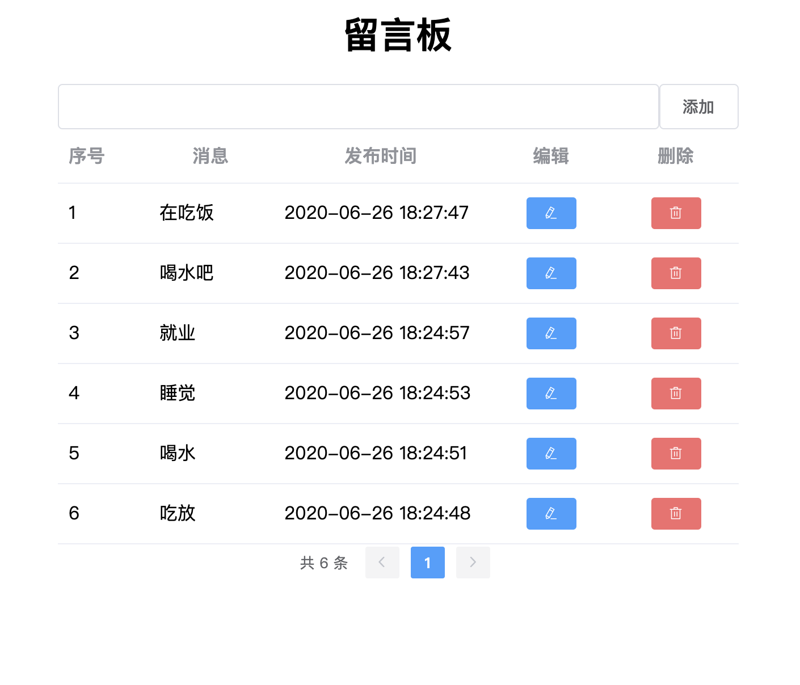

## 基于

受到下面这篇文章的启发，尝试了一下 LeanCloud 的 Serverless 云存储，开发了一个简易的留言板

[前端修 bug 神器「bug 信息收集系统」搭建图解](https://segmentfault.com/a/1190000017271720)

截图

功能：

1. 添加
2. 删除
3. 更新
4. 获取详情
5. 列表分页

开发文档

1. LeanCloud 数据存储开发指南 · JavaScript [https://leancloud.cn/docs/leanstorage_guide-js.html](https://leancloud.cn/docs/leanstorage_guide-js.html)

用到的文档：

1. Vue: [https://cn.vuejs.org/v2/guide/installation.html](https://cn.vuejs.org/v2/guide/installation.html)

2. Element: [https://element.eleme.cn/#/zh-CN/component/installation](https://element.eleme.cn/#/zh-CN/component/installation)

3. momentjs: [https://momentjs.com/](https://momentjs.com/)
